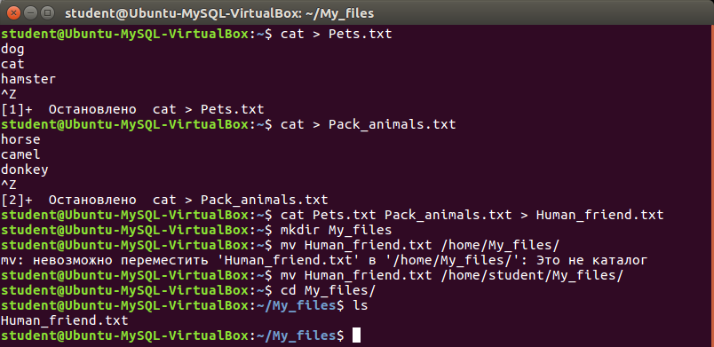
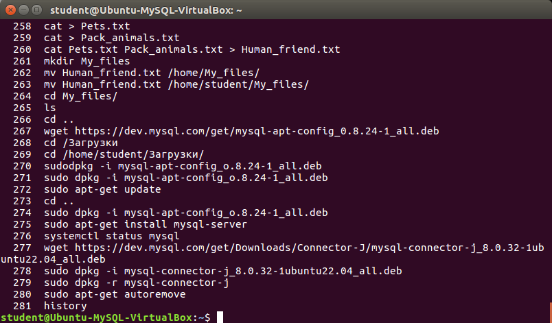
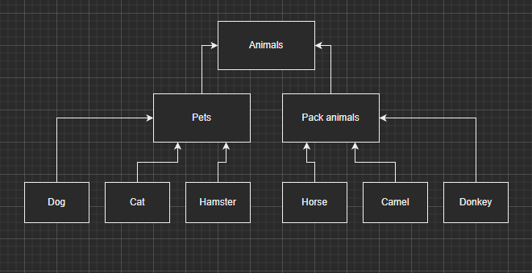

1. Используя команду cat в терминале операционной системы Linux, создать
два файла Домашние животные (заполнив файл собаками, кошками,
хомяками) и Вьючные животными заполнив файл Лошадьми, верблюдами и
ослы), а затем объединить их. Просмотреть содержимое созданного файла.
Переименовать файл, дав ему новое имя (Друзья человека).

	Создание файла "Домашние животные" и заполнение его информацией:
		cat > Pets.txt

	Создание файла "Вьючные животные" и заполнение его информацией:
		cat > Pack_animals.txt

	Объединение двух файлов в один "Друзья человека":
		cat Pets.txt Pack_animals.txt > Human_friends.txt

2. Создать директорию, переместить файл туда.

	Создание директории для файла Human_friends.txt:
		mkdir My_files

	Перемещение файла Human_friends.txt в папку My_files:
		mv Human_friends.txt /home/My_files/

	Переход в папку My_files:
		сd /My_files/

	Проверка нахождения файла в папке:
		ls

3. Подключить дополнительный репозиторий MySQL. Установить любой пакет
из этого репозитория.
	Загрузка конфигуратора mysql:
		wget https://dev.mysql.com/get/mysql-apt-config_0.8.24-1_all.deb

	Переход в папку загрузки и установка компонента mysql с помощью конфигуратора:
		sudo dpkg -i mysql-apt-config_0.8.24-1_all.deb

	Просмотр информации о необходимости обновления:
		sudo apt-get update

	Устанавка mysql-server:
		sudo apt-get install mysql-server

	Проверка результата установки:
		systemctl status mysql

4. Установить и удалить deb-пакет с помощью dpkg.	
	Загрузка пакета для установки:
		wget https://dev.mysql.com/get/Downloads/Connector-J/mysql-connector-j_8.0.32-1ubuntu22.04_all.deb

	Устанавка пакета mysql-connector-j_8.0.32-1ubuntu22.04_all.deb:
		sudo dpkg -i mysql-connector-j_8.0.32-1ubuntu22.04_all.deb

	Удаление пакета и его сопутствующие пакеты:
		sudo dpkg -r mysql-connector-j
		sudo apt-get autoremove

5. Выложить историю команд в терминале ubuntu.

	Команда для вывода истории введенных команд в терминале ubuntu
		history

6. Нарисовать диаграмму, в которой есть класс родительский класс, домашние
животные и вьючные животные, в составы которых в случае домашних
животных войдут классы: собаки, кошки, хомяки, а в класс вьючные животные
войдут: Лошади, верблюды и ослы).

